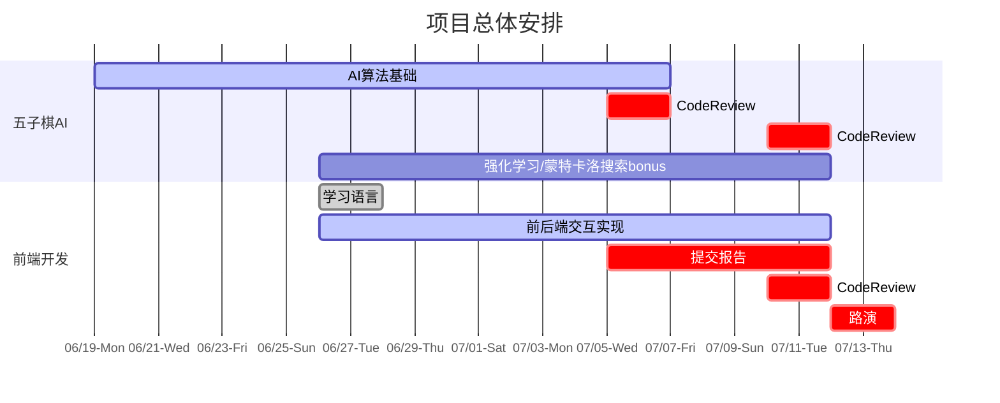

## 程序设计与数据结构III 五子棋项目
负责人：邵方昊 杨宇骁

Codebase Credit: [张志成](https://github.com/Gabr1e1)

Document Credit: [陈文迪](https://github.com/ChenWendi2001) 游灏溢

### 课程内容

- 基于树搜索的棋类AI设计基本思想与相关算法
- *基于强化学习和自我博弈的现代AI算法（以Alpha Zero为例）
- Web前端开发与前后端交互技术


### 开发指南

#### 环境

- 请使用Unix环境开发（如WSL，MacOS）

- 除了C++外还需要用到python编译相关，若没有python/pip环境请自行google并解决。请注意，必须使用python3.5版本及以上。

- 完成本项目至少需要以下python包

  ```
  subprocess
  timeout_decorator
  numpy
  sys
  time
  Flask
  ```

  你可以使用

  ```
  pip install -r requirements.txt
  ```

  来安装包依赖，如遇到安装包依赖相关的困难请及时提出。

#### API

请参照`judge/sample.cpp`的格式实现你的AI，其中：

- `init`: 初始化函数，会在程序开始的时候被调用

- `action(loc)`: `loc`参数为对手采取的行动，需要返回你在这步落子的位置，**注意：** 如果是第3步，返回`(-1,-1)`表示交换颜色，返回坐标表示不选择换手，正常下棋

- `ai_side`变量表示你的AI是哪一边，0黑1白，`ai_name`可以随便填写

 `AIController.h`不需要修改，提交时也仅需要提交`yourcode.cpp`

#### 算法评测

- judge文件夹中含有一个算力不弱的五子棋AI：`baseline`，你可以用于测试AI的性能。

- 运行方式：编译你的AI，接着执行`python judge.py ai0path/human ai1path/human`，写在前面的表示先手，后面的表示后手，例如：`python judge.py ./sample human`

- **Tips：** 你可以通过更改judge.py来输出更多信息

#### 前后端交互

- 请学习HTML语言+CSS语言打造一个可以交互的前端，学会简单的JavaScript语言实现命令处理。参照demo中的例子搭建一个可展示的五子棋界面，可使用浏览器直接打开html文件预览效果。

- 请自学python的Flask相关内容完成后端算法的对接，并将其应用于你的网页上。

- 运行方式：完成前后端交互后执行 `python run.py`，在命令行中你将看到类似于如下输出

  ```
  dantynomac@dantynoel demo % python run.py 
   * Serving Flask app 'run'
   * Debug mode: on
  WARNING: This is a development server. Do not use it in a production deployment. Use a production WSGI server instead.
   * Running on http://127.0.0.1:5000
  Press CTRL+C to quit
   * Restarting with stat
   * Debugger is active!
   * Debugger PIN: 144-469-127
   ...
  ```

  其中包含了一个url（这里是 http://127.0.0.1:5000），在浏览器中输入该网址即可进行交互。

### 项目要求

- **AI单步推理时间限制：5s**
- 必做：实现Minimax搜索，alpha-beta剪枝，迭代加深搜索，性能优化（例如启发式搜索，Zobrist缓存，算杀），支持人机对战的前后端
- 选做：蒙特卡洛树搜索，强化学习相关算法的探索，或是其他创新性的优化策略
- 40% 算法实现（包括与baseline的对战以及小组内车轮战）
- 30% 前端展示&Report
- 30% Code Review



*注:蓝色条带仅代表课程内建议的各项目完成时间节点，仅供参考。红色竖线展示今日时间。*

- **请勿抄袭五子棋AI的算法**
- 前端开发代码引用请注明出处，并完成一篇简短的报告，报告中须包含以下内容：
  - 应用的五子棋AI的算法以及优化
  - 本地运行与baseline对战的胜率
  - 前端所支持的所有操作
  - 完成前后端过程中的问题以及优化内容

### 可供学习的参考资料

#### 算法
- 算法基础教程：https://github.com/lihongxun945/myblog/issues/11
- MCTS：https://www.geeksforgeeks.org/ml-monte-carlo-tree-search-mcts/
- AlphaZero论文：https://www.science.org/doi/10.1126/science.aar6404

#### 前端
- W3Schools https://www.w3school.com.cn/

